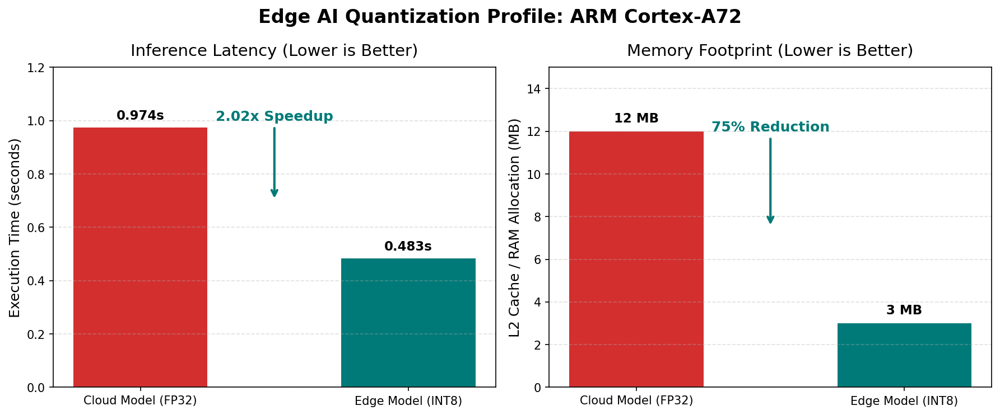

# ARM Edge-AI Quantization Profiler
*Profiling neural network inference precision, memory bottlenecks, and L2 cache saturation on commercial ARMv8-A silicon.*

## 📖 Project Overview
As Edge AI workloads (such as LLMs and Vision models) scale to commercial mobile and IoT devices, they are severely constrained by memory bandwidth. 

This project explores the physical hardware impact of Neural Network Quantization. I developed a C-based microbenchmark executing a dense matrix operation (simulating a MobileNetV2 / Transformer linear layer) on a Broadcom BCM2711 (Cortex-A72). The execution was profiled via physical hardware performance counters (PMUs) to compare standard cloud precision (FP32) against edge-optimized precision (INT8).

## 🔬 Methodology
* Developed an inference layer simulator executing $1024 \times 1024$ tensor multiplications.
* Profiled execution using Linux `perf` to query the silicon's Hardware Performance Monitoring Units.
* Analyzed cache eviction rates, CPU cycle stalls, and Instructions Per Cycle (IPC) to mathematically identify the system bottleneck.

## 📊 Telemetry & Key Findings

| Metric | Cloud Model (FP32) | Edge Model (INT8) | Impact |
| :--- | :--- | :--- | :--- |
| **Execution Time** | 0.974 seconds | 0.483 seconds | **2.02x Speedup** |
| **Data Footprint** | 12 Megabytes | 3 Megabytes | **75% Reduction** |

* **Hardware Cache Saturation:** The profiling trace recorded a massive **26,844,121 L2 Cache Misses** across the execution. The Cortex-A72 features a 1MB L2 cache, which was entirely overwhelmed by the 12MB FP32 memory footprint, forcing constant system RAM evictions.
* **The IPC Bottleneck:** The system recorded an Instructions Per Cycle (IPC) of **0.83**. Because a fully saturated Cortex-A72 pipeline is capable of executing >2 operations per cycle, an IPC of <1.0 mathematically proves the processor execution units are starving. The AI workload is severely **Memory-Bound**, restricted by memory latency and bus bandwidth rather than ALU compute availability.
* **Conclusion:** Moving from FP32 to INT8 yielded a 2.02x performance uplift purely by alleviating pressure on the memory bus. To push IPC higher and achieve further acceleration, the software must be optimized with Loop Tiling (L2 cache localization) and ARM NEON SIMD intrinsics.

## 🛠️ Toolchain
* **Architecture:** ARMv8-A (Cortex-A72)
* **Languages:** C, Bash
* **Profiling:** Linux `perf` subsystem, Hardware PMUs
